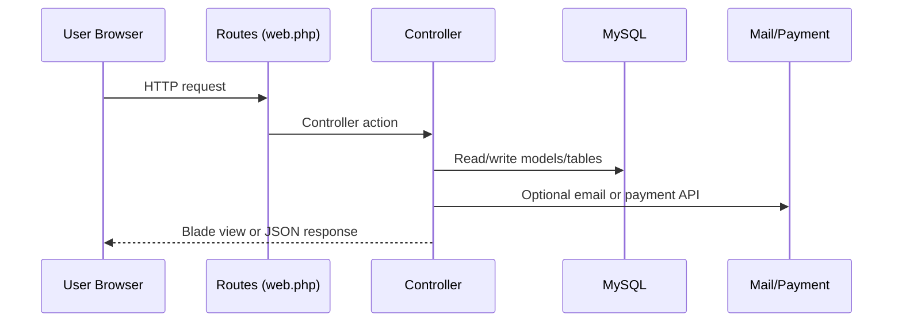

# 01 - Architecture Overview

## What it does

This is a monolithic Laravel MVC app using:
- Blade server-rendered UI,
- session auth,
- Eloquent + Query Builder,
- direct controller orchestration of business logic.

## Where in code

- Routing: `routes/web.php`, `routes/api.php`
- Controllers: `app/Http/Controllers/*`
- Models: `app/Models/*`
- Middleware: `app/Http/Middleware/*`
- Helpers: `app/helpers.php`
- Payment webhook job: `app/Handler/WebhookJobHandlerForPayment.php`

## Request lifecycle (high level)

## Error/logging strategy

- Mostly inline try/catch around Mail/Instamojo calls.
- Many methods return redirects/JSON on validation issues.
- No centralized domain exception strategy detected.

## Safely extending

- Keep logic close to existing controller action to reduce surprise.
- For new complex logic, add a dedicated service/action class and call it from controller (incremental adoption).
- If introducing queued work, use existing DB queue setup pattern.

## Gotchas

- Middleware alias `verified` is duplicated in `app/Http/Kernel.php` and one entry references a likely wrong namespace.
- Route-level auth/role checks are mixed between middleware and controller constructors.
