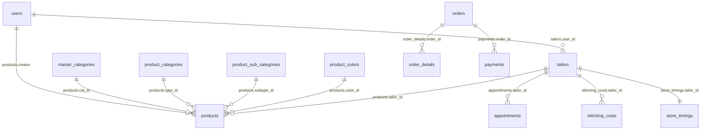

# 06 - Data Model

## What it does

Summarizes key tables and relationships.

## ER-style overview (approximate)

## Key tables

- `users`: auth identities; role/status + contact info.
- `tailors`: tailor profile, services JSON, appointments JSON, commission.
- `store_timings`: day-wise open/close columns per tailor.
- `stitchings`: stitch definitions (type, slug, base cost, show flag).
- `stitching_costs`: tailor-specific cost per stitch slug/name.
- `products`: catalog items (links to category/color/tailor, media, price/commission_price).
- `appointments`: customer appointment requests + status.
- `orders`: checkout header row + status + instamojo order id.
- `order_details`: serialized measurement payload per order.
- `payments`: gateway request/response and transaction status.

## Important enums

- `users.status`: `active|inactive`
- `users.role`: includes admin/vendor/customer and legacy values
- `appointments.status`: `pending|accepted|rejected`
- `orders.status`: migration-expanded values including `failed`, `in progress`, `out for delivery`

## Safely extending

- Prefer additive migrations; do not edit old migrations in-place.
- For JSON columns storing arrays (`services`, `appointments`, `images`), normalize only with a clear migration plan.

Cross-links:
- [Business rules](04-domain-and-business-rules.md)
- [Routes](07-routes-and-api.md)
